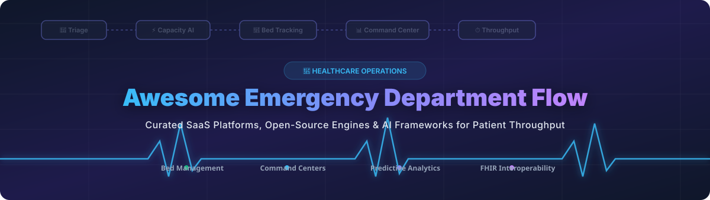

# 🏥 Awesome Emergency Department Flow Management 🚀

  

  
  
  
  
  

---

## 📌 Executive Overview & SEO Index

Welcome to the definitive **Awesome Emergency Department (ED) Flow Management** repository! 🚑 This curated directory tracks premier **Emergency Department Information Systems (EDIS)**, **Hospital Patient Flow Software**, **Bed Management Engines**, **Capacity Planning Dashboards**, **AI Triage Simulators**, and **FHIR Interoperability Infrastructure**.

Whether you are an emergency physician 🩺, hospital chief operational officer 🏢, healthcare data engineer 💻, or AI researcher 🤖 building self-hosted clinical command centers, this guide highlights top enterprise SaaS platforms alongside high-star open-source frameworks.

---

## 📊 Market Overview & Sector Fragmentation

> **Estimated Market Size & Industry Dynamics:**  
> The global **Emergency Department Information System (EDIS) & Patient Flow Management sector** is valued at **$1.15 Billion - $2.50 Billion (2026)** and is projected to expand at a **CAGR of ~13.5%**, surpassing **$4.8 Billion by 2030**.  
>  
> **Market Fragmentation:**  
> The market is **moderately concentrated at the core EHR platform tier** (dominated by enterprise incumbents like Epic, Oracle Health/Cerner, and MEDITECH), but remains **highly fragmented across best-of-breed operational AI and patient flow layers** (e.g., Qventus, LeanTaaS, TeleTracking). Hospitals increasingly adopt hybrid architectures combining core EHR records with specialized predictive capacity orchestration engines. 📈

---

## 📚 Table of Contents

- [🏢 SaaS & Hosted Enterprise Platforms](#-saashosted-enterprise-platforms)
- [💻 Open-Source GitHub Projects & Frameworks](#-open-source-github-projects--frameworks)
- [🛠️ Architectural Blueprint for Self-Hosted ED Command Center](#%EF%B8%8F-architectural-blueprint-for-self-hosted-ed-command-center)
- [🤝 How to Contribute](#-how-to-contribute)
- [💖 Support & Sponsorship](#-support--sponsorship)
- [⚠️ Disclaimer](#%EF%B8%8F-disclaimer)
- [📈 Star History](#-star-history)

---

## 🏢 SaaS/Hosted Enterprise Platforms

Below is a comparative matrix of commercial healthcare flow management platforms, sorted descending by estimated enterprise valuation / company scale. 🏆

| Platform | Core Capabilities | Starting Price | Free Tier / Trial Limits | Enterprise Scale / Valuation |
| :--- | :--- | :--- | :--- | :--- |
| **Oracle Health Patient Flow** 🏛️ | Near-real-time visibility into bed utilization, length of stay, transfers, EVS, and transportation. | Custom enterprise quotes (~$150,000/yr starting tier) | No free trial; interactive sandbox demo available via sales representative | **$300 Billion+** (Oracle Market Cap) |
| **GE HealthCare Command Center** 🛰️ | Enterprise command-center visibility, staffing demand, transfer centers, and operational decision support. | Custom enterprise licensing (~$200,000/yr base) | Guided prototype evaluation & 30-day proof-of-concept (POC) via sales | **$35 Billion+** (GE HealthCare Market Cap) |
| **Epic Systems (Grand Central / OpTime)** 🏥 | EHR-integrated bed management, capacity planning, ED tracking, and throughput analytics. | Included in core Epic EHR contract (~$500,000+ deployment tier) | No public free trial; UserWeb sandbox access for licensed health system staff | **$10 Billion+** (Estimated Enterprise Valuation) |
| **RLDatix** 🛡️ | Operational risk management, staffing optimization, and clinical throughput coordination. | Custom B2B tier (~$25,000/yr starting module) | 14-day enterprise product demonstration & guided trial upon request | **$3 Billion+** (Private Equity Valuation) |
| **LeanTaaS (iQueue for Inpatient)** ⚡ | AI-powered capacity management addressing ED boarding, infusion center scheduling, and OR flow. | Custom health system pricing (~$50,000/yr starting module) | No free trial; 30-day pilot program available for qualified health networks | **$1 Billion+** (Unicorn Valuation) |
| **symplr** 📑 | Enterprise healthcare operations, provider credentialing, workforce management, and throughput. | Custom enterprise quotes (~$30,000/yr starting tier) | Guided sales demo; no self-serve free trial | **$1 Billion+** (Estimated Private Valuation) |
| **QGenda** 📅 | Automated physician scheduling, clinical workforce capacity planning, and ED on-call management. | Custom tier (~$10,000/yr starting facility fee) | 14-day custom sandbox trial for clinical operations teams | **$1 Billion+** (Estimated Private Valuation) |
| **Innovaccer** 🌐 | Healthcare data platform supporting patient access, care workflow, and operational throughput analytics. | Custom SaaS tier (~$40,000/yr starting solution) | 30-day developer sandbox access for API integration testing | **$1.3 Billion** (Valuation) |
| **Central Logic (About Healthcare)** 🔄 | Enterprise transfer-center management, bed availability tracking, and regional capacity orchestration. | Custom hospital licensing (~$45,000/yr starting) | Guided live demo; no standalone free trial | **$500 Million+** (Estimated Private Valuation) |
| **TeleTracking Operations IQ** 🎯 | Comprehensive throughput, bed placement, transfer-center, EVS, and command-center orchestration. | Custom hospital licensing (~$60,000/yr starting tier) | No free trial; on-site operational assessment pilot available | **$500 Million+** (Estimated Private Valuation) |
| **Qventus** 🧠 | AI-native ED flow optimization predicting crowding, identifying bottlenecks, and automating discharge steps. | Custom enterprise quotes (~$50,000/yr starting facility rate) | Guided 30-day proof-of-value (POV) trial for health system partners | **$400 Million** (Valuation) |
| **Care Logistics** 🚚 | Centralized hospital logistics, patient progression, bed placement, transport, and throughput control. | Custom hospital licensing (~$40,000/yr starting) | Custom operational assessment & 30-day trial pilot | **$150 Million+** (Estimated Valuation) |

---

## 💻 Open-Source GitHub Projects & Frameworks

The following open-source projects provide complete applications, domain engines, discrete-event simulators, time-series forecasting tools, and interoperability building blocks for Emergency Department operations. 

Sorted descending by **GitHub Star Count** ⭐.

| Project & Repository | Description & ED Use Case | GitHub Stars Badge |
| :--- | :--- | :--- |
| **[PyTorch](https://github.com/pytorch/pytorch)** 🤖 | Deep learning framework for complex ED arrival forecasting, length-of-stay modeling, and computer vision. |  |
| **[Grafana](https://github.com/grafana/grafana)** 📊 | Observability and visualization platform suitable for real-time hospital command-center metric displays. |  |
| **[Redis](https://github.com/redis/redis)** ⚡ | In-memory key-value store powering real-time patient queues, bed state caches, and instant alert routing. |  |
| **[Apache Superset](https://github.com/apache/superset)** 📈 | Enterprise BI and data exploration platform for building real-time ED throughput and bottleneck dashboards. |  |
| **[scikit-learn](https://github.com/scikit-learn/scikit-learn)** 🔬 | Machine learning library for predicting ED admissions, readmission risk, wait times, and triage scoring. |  |
| **[ClickHouse](https://github.com/ClickHouse/ClickHouse)** 🗄️ | High-performance column-store SQL database for high-volume healthcare event streams and telemetry logs. |  |
| **[Metabase](https://github.com/metabase/metabase)** 💡 | Easy-to-use business intelligence application for quick operational reporting on patient length of stay. |  |
| **[Apache Airflow](https://github.com/apache/airflow)** 🌪️ | Workflow management platform for scheduling healthcare data pipelines, ETL, and daily capacity reports. |  |
| **[Apache Spark](https://github.com/apache/spark)** 💥 | Unified analytics engine for large-scale historical processing of multi-year ED patient throughput logs. |  |
| **[Keycloak](https://github.com/keycloak/keycloak)** 🔐 | Identity and access management server for securing multi-role ED dashboards and clinician command centers. |  |
| **[Apache Kafka](https://github.com/apache/kafka)** 📩 | Distributed event-streaming platform for streaming real-time ADT events, bed status changes, and triage updates. |  |
| **[XGBoost](https://github.com/dmlc/xgboost)** 🚀 | Optimized gradient boosting library for precision predictions of ED arrivals, crowding, and bed availability. |  |
| **[Apache Flink](https://github.com/apache/flink)** 🌊 | Real-time stream processing framework for calculating continuous ED crowding metrics like NEDOCS. |  |
| **[Node-RED](https://github.com/node-red/node-red)** 🔌 | Flow-based programming tool for wiring together medical IoT sensors, nurse call buttons, and notification alerts. |  |
| **[TimescaleDB](https://github.com/timescale/timescaledb)** ⏱️ | Time-series database extension for PostgreSQL designed to track real-time patient status events and metrics. |  |
| **[Temporal](https://github.com/temporalio/temporal)** ⏳ | Microservice orchestration engine ensuring reliable completion of patient admission and transfer workflows. |  |
| **[LightGBM](https://github.com/microsoft/LightGBM)** ⚡ | Fast gradient boosting tree framework for clinical risk triage scoring and resource demand modeling. |  |
| **[Optuna](https://github.com/optuna/optuna)** 🎛️ | Hyperparameter optimization framework for tuning machine learning models used in patient flow forecasting. |  |
| **[Google OR-Tools](https://github.com/google/or-tools)** 🧮 | Suite for combinatorial optimization used in ED shift scheduling, bed assignment, and physician routing. |  |
| **[Open Policy Agent (OPA)](https://github.com/open-policy-agent/opa)** 🛡️ | Policy engine enforcing fine-grained role-based access control (RBAC) across patient tracking software. |  |
| **[Darts](https://github.com/unit8co/darts)** 🎯 | Python library for user-friendly forecasting of ED daily census, hourly arrivals, and discharge rates. |  |
| **[Matter (ConnectedHomeIP)](https://github.com/project-chip/connectedhomeip)** 🏠 | Open smart device connectivity protocol applicable to hospital room IoT beacons and patient badges. |  |
| **[HospitalRun](https://github.com/HospitalRun/hospitalrun-frontend)** 🏥 | Modern user interface for offline-first open-source hospital management and patient records. |  |
| **[OpenEMR](https://github.com/openemr/openemr)** 📋 | ONC Certified open-source EHR and medical practice management solution with ED encounter capabilities. |  |
| **[StatsForecast](https://github.com/Nixtla/statsforecast)** 📉 | Ultra-fast statistical time-series algorithms for high-frequency hospital demand forecasting. |  |
| **[Camunda Platform](https://github.com/camunda/camunda-bpm-platform)** 🔄 | Process automation and BPMN workflow engine for orchestrating complex clinical escalation pathways. |  |
| **[Medplum](https://github.com/medplum/medplum)** 🩺 | Open-source developer platform built on FHIR APIs for rapidly constructing custom patient flow applications. |  |
| **[Pyomo](https://github.com/Pyomo/pyomo)** 📐 | Python-based mathematical programming language for formulation of complex hospital staff and bed optimization. |  |
| **[PuLP](https://github.com/coin-or/pulp)** 📝 | Linear programming modeler in Python used to optimize nurse allocation and emergency bed capacity. |  |
| **[HAPI FHIR](https://github.com/hapifhir/hapi-fhir)** 🌿 | Complete open-source HL7 FHIR specification implementation in Java for healthcare data interoperability. |  |
| **[OpenMRS Core](https://github.com/openmrs/openmrs-core)** 🌍 | Open-source enterprise electronic medical record system platform powering health deployments globally. |  |
| **[CARE HMIS](https://github.com/ohcnetwork/care)** 🏥 | Modern healthcare management information system featuring real-time patient queues, triage, and bed tracking. |  |
| **[salabim](https://github.com/salabim/salabim)** 🎲 | Object-oriented Python discrete-event simulation framework tailored for modeling hospital queue networks. |  |
| **[Bahmni Core](https://github.com/bahmni/bahmni-core)** 🏥 | EMR and hospital information system tailored for low-resource environments integrating OpenMRS and OpenELIS. |  |
| **[OpenHIM Core](https://github.com/jembi/openhim-core-js)** 🔀 | Health information mediator facilitating interoperability between hospital systems and ED analytics engines. |  |

---

## 🛠️ Architectural Blueprint for Self-Hosted ED Command Center

To construct a full-stack, enterprise-grade Emergency Department Flow Management Platform using open-source building blocks, we recommend the following modular stack:

1. **Core Clinical Foundation (HIS/EHR):** [CARE HMIS](https://github.com/ohcnetwork/care), [OpenMRS](https://github.com/openmrs/openmrs-core), or [OpenEMR](https://github.com/openemr/openemr).
2. **Real-Time Command Dashboard:** Custom React/TypeScript frontend integrated with [Grafana](https://github.com/grafana/grafana) or [Apache Superset](https://github.com/apache/superset).
3. **Interoperability & Data Layer:** [HAPI FHIR](https://github.com/hapifhir/hapi-fhir) or [Medplum](https://github.com/medplum/medplum) paired with [OpenHIM](https://github.com/jembi/openhim-core-js).
4. **Streaming & Event Processing:** [Apache Kafka](https://github.com/apache/kafka) + [Apache Flink](https://github.com/apache/flink) for real-time NEDOCS crowding metric computation.
5. **Predictive AI & Optimization:** [scikit-learn](https://github.com/scikit-learn/scikit-learn) / [XGBoost](https://github.com/dmlc/xgboost) for LOS forecasting and [Google OR-Tools](https://github.com/google/or-tools) for bed assignment.
6. **Workflow Automation:** [Temporal](https://github.com/temporalio/temporal) or [Camunda](https://github.com/camunda/camunda-bpm-platform) for patient transport and environmental cleaning alerts.

---

## 🤝 How to Contribute

We welcome contributions from healthcare professionals, engineers, and researchers! 🌟

1. Fork this repository 🍴.
2. Add your commercial platform or open-source project to the appropriate table.
3. Ensure technical accuracy and provide clear descriptions.
4. Verify link destinations and submit a pull request (PR) 🚀.

---

## 💖 Support & Sponsorship

If you find this curated resource helpful for your clinical operations, research, or development work, please consider supporting the project:

- ⭐ **Star this repository** to help others discover it.
- 🔄 **Share it** with healthcare AI teams and hospital engineering leads.
- ☕ **Sponsor the Maintainer:** Your support helps maintain high-quality open-source ecosystem lists!  
  👉 [**Sponsor ishandutta2007 on GitHub**](https://github.com/sponsors/ishandutta2007) ❤️

---

## ⚠️ Disclaimer

This directory is an educational and reference resource and does not constitute medical advice, clinical recommendation, or formal software endorsement. Deployments handling Protected Health Information (PHI) must adhere to relevant regulatory guidelines (such as HIPAA, GDPR, and ISO27001).

---

## 📈 Star History

---

  Made with ❤️ for emergency physicians, ED nurses, hospital command centers, and open-source healthcare builders worldwide.

